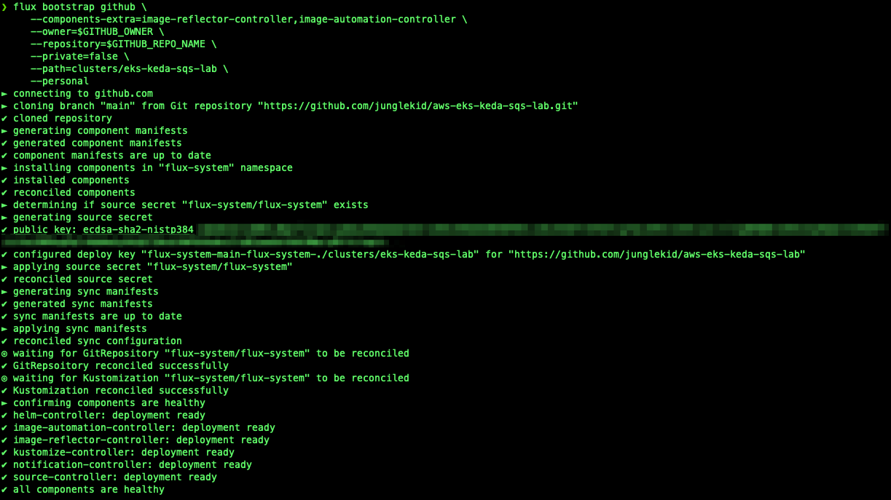

# Using Keda to Scale AWS SQS with Amazon Elastic Kubernetes Service (EKS)

## Table of Contents

1. [Create and Push SQS App Docker Images to Amazon ECR](#create-and-push-sqs-app-docker-image-to-amazon-ecr)
   1. [Build the Docker Images](#build-the-docker-images)
   2. [Push the Docker Images to Amazon ECR](#push-the-docker-images-to-amazon-ecr)

## Configure access to Amazon EKS Cluster

Amazon EKS Cluster details can be extracted from terraform output or by accessing the AWS Console to get the name of the cluster. This following command can be used to update the kubeconfig in your local machine where you run kubectl commands to interact with your EKS Cluster. Navigate to the root of the directory of the GitHub repo and run the following commands:

   ```bash
   cd terraform

   AWS_REGION=$(terraform output -raw aws_region)
   EKS_CLUSTER_NAME=$(terraform output -raw eks_cluster_name)
   aws eks --region $AWS_REGION update-kubeconfig --name $EKS_CLUSTER_NAME
   ```

Results of configuring kubeconfig.


## Create and Push SQS App Docker Images to Amazon ECR

## Build the Docker Images

Set the variables needed to build and push your Docker image. Navigate to the root of the directory of the GitHub repo and run the following commands:

```bash
cd terraform

AWS_REGION=$(terraform output -raw aws_region)
ECR_SQS_CONSUMER_REPO=$(terraform output -raw ecr_sqs_consumer_repo_url)
ECR_SQS_PRODUCER_REPO=$(terraform output -raw ecr_sqs_producer_repo_url)
```

To build the Docker image, run the following command:

```bash
cd ..
docker build --platform linux/amd64 --no-cache --pull -t ${ECR_SQS_CONSUMER_REPO}:latest ./containers/sqs-consumer
docker build --platform linux/amd64 --no-cache --pull -t ${ECR_SQS_PRODUCER_REPO}:latest ./containers/sqs-producer
```

## Push the Docker Images to Amazon ECR

To push the Docker image to Amazon ECR, authenticate to your private Amazon ECR registry. To do this, run the following command:

```bash
aws ecr get-login-password --region $AWS_REGION | docker login --username AWS --password-stdin $ECR_SQS_CONSUMER_REPO
aws ecr get-login-password --region $AWS_REGION | docker login --username AWS --password-stdin $ECR_SQS_PRODUCER_REPO
```

Once authenticated, run the following command to push your Docker image to the Amazon ECR repository:

```bash
docker push ${ECR_SQS_CONSUMER_REPO}:latest
docker push ${ECR_SQS_PRODUCER_REPO}:latest
```

## Configure and Install Flux

1. Configure Variables needed to install Flux

   ```bash
   export GITHUB_TOKEN='<REPLACE_WITH_GITHHUB_TOKEN>'
   export GITHUB_USER='<REPLACE_WITH_GITHUB_USER>'
   export GITHUB_OWNER='<REPLACE_WITH_GITHUB_OWNER>'
   export GITHUB_REPO_NAME='<REPLACE_WITH_GITHUB_REPO_NAME>'
   ```

2. Configure Flux Repository by running the "configure.sh" script. The "configure.sh" script updates the various applications with the necessary values to run correctly. Navigate to the root of the directory of the GitHub repo and run the following commands:

   ```bash
   cd scripts

   ./configure.sh
   cd ..
   ```

3. Results of running the "configure.sh" script.

   

4. Install Flux on the Amazon EKS Cluster

   ```bash
   flux bootstrap github \
     --components-extra=image-reflector-controller,image-automation-controller \
     --owner=$GITHUB_OWNER \
     --repository=$GITHUB_REPO_NAME \
     --private=false \
     --path=clusters/eks-keda-sqs-lab \
     --personal
   ```

5. Results of installing Flux on the Amazon EKS Cluster.

   

6. Wait 2 to 5 minutes for Flux to reconcile the Git repository we specified, During this time, Flux will install and configure all of the defined Kubernetes Addons and Applications.

7. Run the following command to check if all of the Kubernetes Addons and Applications deployed successfully

   ```bash
   flux get all -A
   ```
